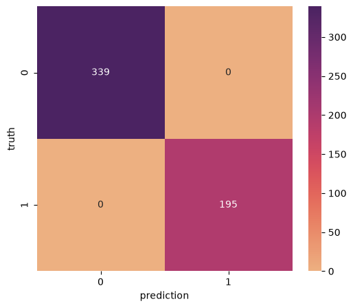

# Room Occupancy Detection

## 📌 Project Overview

This project is a **machine learning classification project** designed
to determine whether a room is occupied by a person or not.

The model receives environmental and sensor-related information from a
room and predicts one of two classes:

-   **0 → No person in the room**
-   **1 → A person is in the room**

The main idea is to use measurable room conditions such as temperature,
humidity, light, carbon dioxide concentration, and HR to recognize the
occupancy state.

------------------------------------------------------------------------

## 🎯 Project Goal

The goal of this project is to build and evaluate a machine learning
model that can classify the state of a room based on sensor data.

This type of system can be useful as a basic component of:

-   Smart classrooms
-   Smart homes
-   Energy management systems
-   Automatic lighting and ventilation
-   Building monitoring systems
-   IoT-based occupancy detection

------------------------------------------------------------------------

## 📊 Input Data

The model uses the following five input features:

  Feature         Description
  --------------- -------------------------------------------
  `Temperature`   Temperature measured in the room
  `Humidity`      Humidity level measured in the room
  `Light`         Amount of light detected in the room
  `CO2`           Carbon dioxide level measured in the room
  `HR`            HR sensor value included in the dataset

The target variable is:

  Label   Meaning
  ------- ------------------
  `0`     Room is empty
  `1`     Room is occupied

The notebook shows that the dataset contains the columns `Temperature`,
`Humidity`, `Light`, `CO2`, `HR`, and `Occupancy`.

------------------------------------------------------------------------

## 🗂️ Dataset Preparation

First, the complete dataset was divided into two classes according to
the occupancy label:

-   `DATA_label_0.csv`
-   `DATA_label_1.csv`

After that, each class was divided into training and testing data using
`train_test_split`.

A test size of **20%** was used for both classes, with `random_state=42`
so that the split could be reproduced.

The generated files were:

-   `DATA_label_0_train.csv`
-   `DATA_label_0_test.csv`
-   `DATA_label_1_train.csv`
-   `DATA_label_1_test.csv`

The training portions were used to train the model, while the testing
portions were kept for evaluating the model.

------------------------------------------------------------------------

## 🤖 Model Training with Machine Learning for Kids

The training data was uploaded to **Machine Learning for Kids**, where
the classification model was trained.

The project used the ML for Kids numerical classification interface to
learn the relationship between the five input values and the occupancy
labels.

The trained model was later accessed from the Python notebook so that
test data could be classified automatically.

### ML for Kids Project

[Open the Machine Learning for Kids
project](https://machinelearningforkids.co.uk/#!/mlproject/auth0%7C6a3ff811e5bcd04edd00d4cb/1)

------------------------------------------------------------------------

## 🧪 Testing the Model

After training, the model was tested using data that had not been used
during training.

For each test record, the notebook sends the following values to the
model:

``` text
Temperature
Humidity
Light
CO2
HR
```

The model returns a predicted class. The prediction is then compared
with the actual label.

The notebook stores the results in two columns:

-   `truth` → the correct/actual class
-   `prediction` → the class predicted by the model

This makes it possible to examine which samples were classified
correctly and which samples were misclassified.

The notebook contains separate prediction results for the two occupancy
classes and combines the actual labels and predictions for evaluation.

------------------------------------------------------------------------

## 📈 Confusion Matrix

A confusion matrix is used to visualize the relationship between the
actual labels and the model's predictions.

For this binary classification problem, the matrix contains the
following four cases:

-   **True Negative (TN):** Empty room correctly predicted as empty.
-   **False Positive (FP):** Empty room incorrectly predicted as
    occupied.
-   **False Negative (FN):** Occupied room incorrectly predicted as
    empty.
-   **True Positive (TP):** Occupied room correctly predicted as
    occupied.

The notebook creates the confusion matrix using `confusion_matrix` from
`sklearn.metrics` and displays it as a heatmap.

### Confusion Matrix





------------------------------------------------------------------------

## 📏 Evaluation Metrics

The project can be evaluated using several classification metrics,
including:

### Accuracy

Measures the proportion of all predictions that are correct.

### Precision

Measures how many samples predicted as a particular class actually
belong to that class.

### Recall

Measures how many samples belonging to a class were correctly detected.

### Confusion Matrix

Provides a detailed view of correct and incorrect predictions for both
classes.

The notebook imports `accuracy_score` and `precision_score` from
`sklearn.metrics` and also generates the confusion matrix.

------------------------------------------------------------------------

## 🧩 Project Workflow

The complete workflow can be summarized as follows:

``` text
Complete Dataset
       ↓
Split by Occupancy Label
       ↓
Label 0 Dataset       Label 1 Dataset
       ↓                    ↓
Train / Test           Train / Test
       ↓                    ↓
Training Data → Machine Learning for Kids
                         ↓
                    Trained Model
                         ↓
                    Test Data
                         ↓
                     Predictions
                         ↓
              Actual vs. Predicted
                         ↓
               Evaluation Metrics
                         ↓
                Confusion Matrix
```

------------------------------------------------------------------------

## 🛠️ Technologies and Tools

This project uses:

-   **Python**
-   **Jupyter Notebook**
-   **Pandas** for data handling
-   **Scikit-learn** for data splitting and evaluation
-   **Matplotlib** for visualization
-   **Seaborn** for the confusion-matrix heatmap
-   **Machine Learning for Kids** for model training

------------------------------------------------------------------------

## 📁 Project Files

A possible project structure is:

``` text
Room-Occupancy-Detection/
│
├── my_page.ipynb
├── DATA_label_0.csv
├── DATA_label_1.csv
├── DATA_label_0_train.csv
├── DATA_label_0_test.csv
├── DATA_label_1_train.csv
├── DATA_label_1_test.csv
├── confusion_matrix.png
├── README.md
└── README_FA.md
```

------------------------------------------------------------------------

## 💡 Why These Features?

Room occupancy can affect environmental measurements. For example, the
presence of a person may be associated with changes in temperature,
humidity, light conditions, and CO2 concentration. The model learns
patterns in these measurements from the training data rather than using
a manually written rule.

------------------------------------------------------------------------

## ⚠️ Limitations

The quality of the predictions depends on the quality and variety of the
training data.

Possible limitations include:

-   Sensor measurement errors
-   Changes in room conditions
-   Different room layouts
-   Different numbers of people
-   Conditions that were not sufficiently represented in the training
    data

Therefore, the model should be evaluated with representative test data
before being used in a real-world monitoring system.

------------------------------------------------------------------------

## 🚀 Future Improvements

Possible future improvements include:

1.  Collecting a larger and more diverse dataset.
2.  Including data from different rooms and environmental conditions.
3.  Testing the model with real-time sensor data.
4.  Comparing different machine learning algorithms.
5.  Reporting additional metrics such as recall and F1-score.
6.  Creating a simple dashboard or graphical interface for real-time
    occupancy detection.
7.  Connecting the system to IoT sensors.

------------------------------------------------------------------------

## 👩‍💻 Conclusion

This project demonstrates a complete basic machine learning workflow for
room occupancy detection: preparing labeled data, separating training
and testing data, training a classifier with Machine Learning for Kids,
testing the trained model with unseen data, comparing actual and
predicted labels, and evaluating the results with a confusion matrix.

The project provides a practical example of how environmental sensor
data can be used for a simple classification problem.
